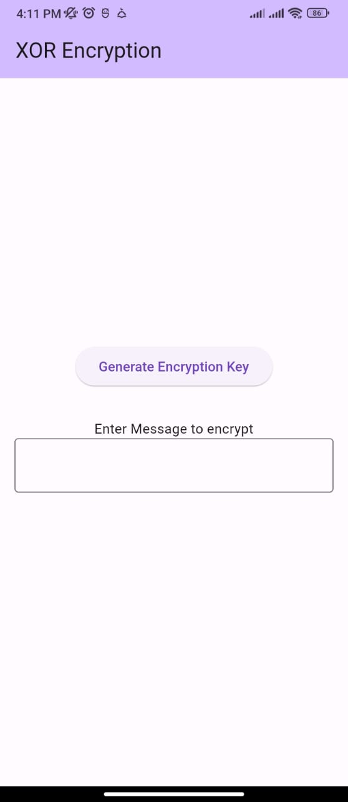
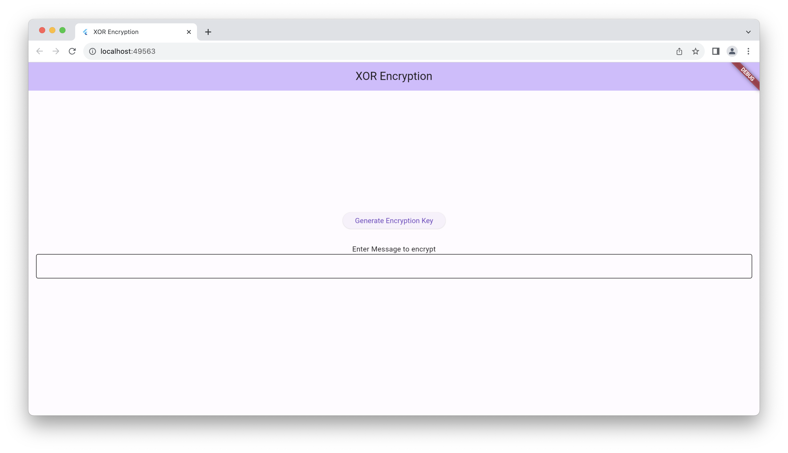
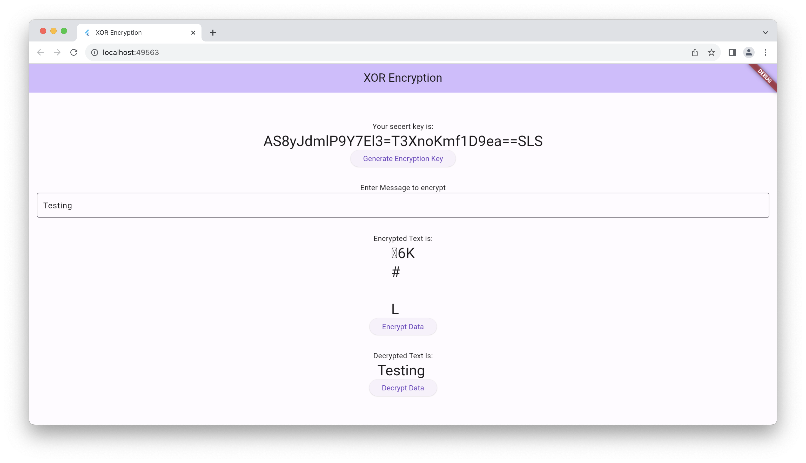

XOR Encryption is an encryption method used to encrypt data and is hard to crack by brute-force method, i.e generating random encryption keys to match with the correct one. The XOR Encryption algorithm is a very effective yet easy to implement method of symmetric encryption. Due to its effectiveness and simplicity, the XOR Encryption is an extremely common component used in more complex encryption algorithms used nowadays. In cryptography, the simple XOR cipher is a type of additive cipher, an encryption algorithm that operates according to the principles of exclusive or operator.

## Features

- Encryption & Decryption of String using XOR Cipher

## Getting started

```dart
    dart pub add xor_encryption
```

```dart
import 'package:xor_encryption/xor_encryption.dart';
```

## Usage

```dart
void main() {
    final String key = XorCipher().getSecretKey(20);
    print('key: $key');
    String text = '123456';
    final encrypted =XorCipher().encryptData(text,key);
    print('encreypteed: ${encrypted}');
    final decrypted =XorCipher().encryptData(encrypted,key);
    print('encreypteed: ${decrypted}');
}
```

# Mobile Screenshots

     

# Web screenshots

     
